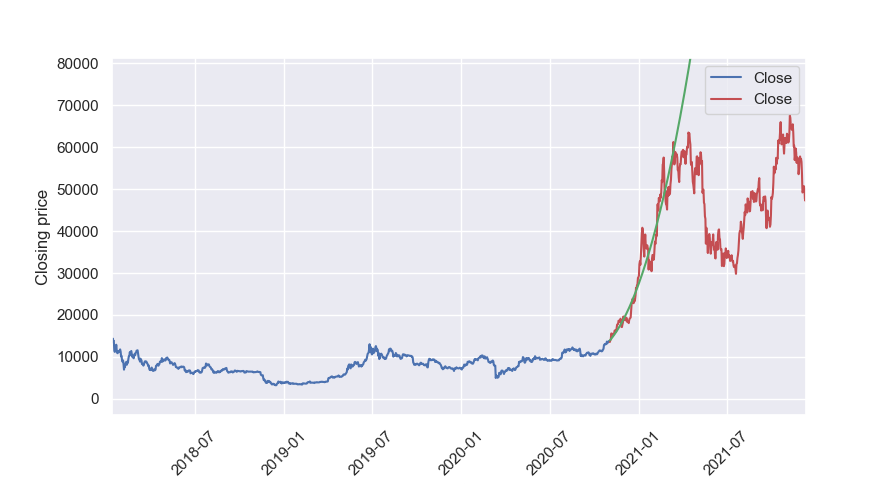

# BTCForcaster: Bitcoin price forecasting

## Overview

`BTCForecaster` is a Python tool for forecasting the closing prices of Bitcoin (BTC) using various time series models
including **ARMA**, **ARIMA**, and **SARIMA**. The script allows for data reading, preprocessing, model training,
prediction, and visualization of the results.

## Installation

### Prerequisites

- Python 3.x
- pandas
- seaborn
- sklearn
- statsmodels

You can install the necessary libraries using pip:

```bash
pip install pandas numpy seaborn matplotlib sklearn statsmodels
```

## Usage

Run the script with:

```bash
python main.py
```

### Results

The following results are generated:

- A series of plots showing the predictions vs. the actual closing prices.
- Printed RMSE values for each model.

#### Example Plot


