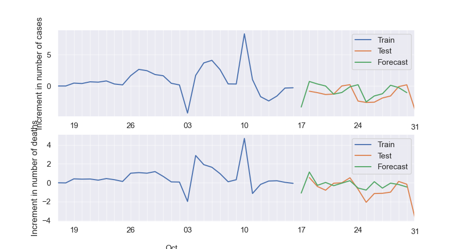

# Covid Forecaster

The `CovidForecaster` is a Python-based tool designed to forecast future trends in COVID-19 cases and deaths based on
historical data. Utilizing statistical methods like **vector autoregression** (VAR) and data pre-processing techniques
such as scaling and differencing, this model helps in understanding the progression of the pandemic.

## Installation Requirements

This tool requires Python 3.x and the following libraries:

- pandas
- seaborn
- scikit-learn
- statsmodels

To install the required libraries, you can use `pip`:

```
pip install pandas seaborn scikit-learn statsmodels
```

## Key Methods

- **Data Reading and Preprocessing**: Data is read and preprocessed to ensure it is suitable for modeling. This includes
  checking for stationarity and applying transformations like differencing and scaling.
- **Model Training and Prediction**: The tool supports training a VAR model and making predictions based on the trained
  model.
- **Plotting**: Visualizations are provided to understand the data trends and the performance of the model.

## Results

The model provides graphical outputs to visualize:

- **Differenced Data**: Shows the changes in COVID-19 cases and deaths over time, helping to highlight trends.
- **Forecast Results**: Visual predictions of future cases and deaths, aiding in visualizing the impact of the pandemic
  over the next horizon period.

1. **Unscaled results**
   

2. **Results from cases and deaths prediction**
   
