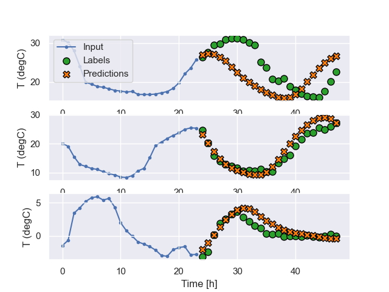
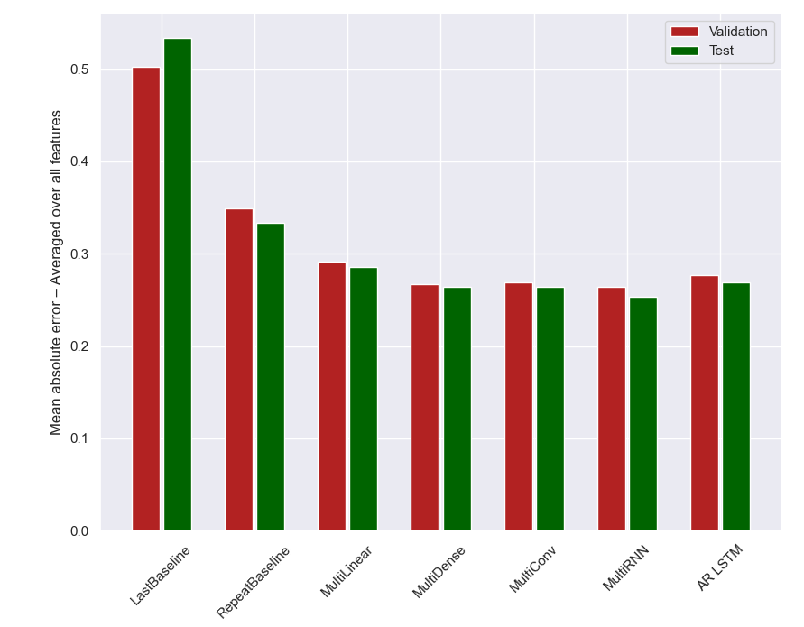

# Forecasting – Weather ML Model

This project implements a comprehensive time-series forecasting model using various machine learning techniques. The
model can preprocess weather data, create various types of data windows, and train multiple models to predict future
weather conditions.

## Installation

To use this project, you need to have Python installed. You can install the necessary dependencies using `pip`:

```bash
pip install -r requirements.txt
```

## Data Preprocessing

The data preprocessing steps include:

1. Reading the data from a CSV file.
2. Creating new features such as wind vector components and cyclical time features.
3. Removing unnecessary columns and outliers.
4. Splitting the data into training, validation, and test sets.
5. Normalizing the data.

## Model Training

The model supports training various architectures:

- Baseline
- Linear
- Dense
- Convolutional
- LSTM
- Residual LSTM
- Multi Last Baseline
- Multi Repeat Baseline
- Multi Linear
- Multi Step Dense
- Multi Dense
- Multi Conv
- Multi LSTM
- Multi Autoregressive LSTM

Models prefixed with _multi_ uses all the features (17) as labels for prediction.

## Usage

To use the model, execute the following python script with the respective command line arguments:

```bash
python forecasting_model.py --window-type single --model-name rnn
```

## Results

After training, the model evaluates the performance on validation and test datasets. The results are saved in JSON
format and can be plotted for comparison.

## Example output

### Mean Absolute Error (MAE)

Single step accuracy for the _temperature_ feature


### LSTM Model

Single step predictions for the LSTM model


### Mean Absolute Error (MAE)

Multi step accuracy for the _temperature_ feature (LSTM)



### Multi-Step Forecasting

Multi step accuracy averaged over all features


